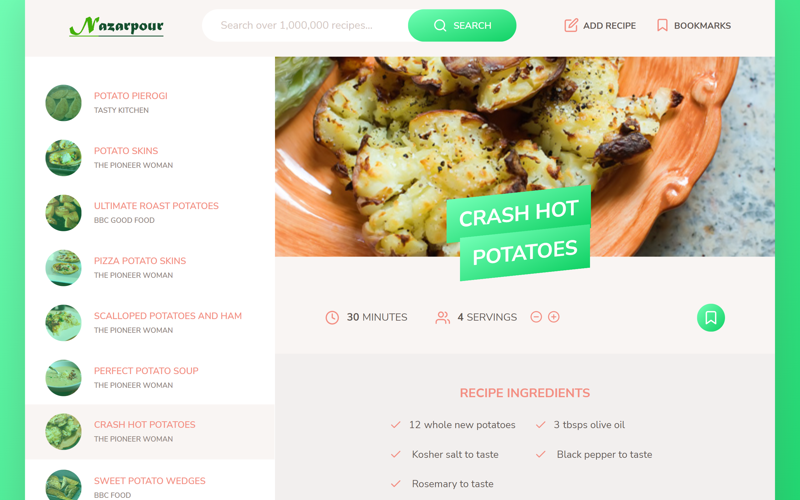

### A vanilla JavaScript application that interacts with the Forkify API to fetch and display recipe food data. This app uses modern JavaScript tools, such as Webpack to bundle the modules, and Babel to convert ES6, ES7 and ES8 back to ES5. The user can search for a specific recipe, and save to a favorites list via local storage. The user can easily increase or decrease servings as per his need and can view detailed directions.
### This project was from Jonas Schmedtmann's 'The Complete JavaScript Course' on Udemy. My additional features and code refactoring include -
### Live demo:  <a href="https://infinite-scroll-v2.netlify.app/">https://infinite-scroll-v2.netlify.app/</a>

 
 

> npm install

> npm start

> npm run build

